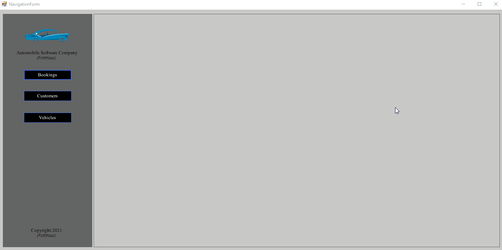

# An overview

<!--- How to add gif from: https://josephcardillo.medium.com/how-to-add-gifs-to-your-github-readme-89c74da2ce47 --->

## A description of how it works
A fictitious automobile software program that allows one to make vehicle bookings.

The project type used is Winforms, utilising the C# language. A SQLite database is used for the backend.

The primary information about the project itself includes:
1. Bookings
2. Customers
3. Vehicles

# Licensing
The license is Attribution-ShareAlike 4.0 International (CC BY-SA 4.0).
Link: https://creativecommons.org/licenses/by-sa/4.0/

# Contact information
If you have any further questions, feel free to reach out to me at:
- Email: kylejulies8@gmail.com

# References for the program
There are many references and attributions used for this program. See the references.txt file.

